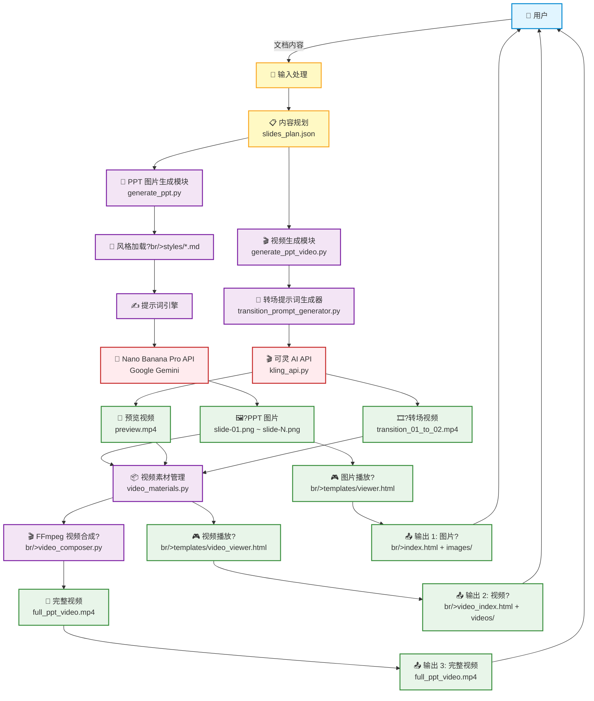

# PPT Generator Pro 架构文档

## 📐 系统架构?



## 🏗?模块架构

### 1️⃣ 核心生成模块

```
┌─────────────────────────────────────────────────────────────?
?                   PPT Generator Pro                         ?
├─────────────────────────────────────────────────────────────?
?                                                             ?
? ┌────────────────────?       ┌──────────────────────?   ?
? ? 图片生成模块      ?       ?  视频生成模块       ?   ?
? ? generate_ppt.py   ?       ?generate_ppt_video.py?   ?
? └────────────────────?       └──────────────────────?   ?
?          ?                             ?                 ?
?          ?                             ?                 ?
? ┌────────────────────?       ┌──────────────────────?   ?
? ? 风格系统          ?       ? 转场提示词生?     ?   ?
? ? styles/*.md       ?       ?transition_prompt_   ?   ?
? ?                   ?       ?  generator.py       ?   ?
? └────────────────────?       └──────────────────────?   ?
?          ?                             ?                 ?
?          ?                             ?                 ?
? ┌────────────────────?       ┌──────────────────────?   ?
? ?Nano Banana Pro    ?       ?  可灵 AI API        ?   ?
? ?(Gemini 3 Pro)     ?       ?  kling_api.py       ?   ?
? └────────────────────?       └──────────────────────?   ?
?          ?                             ?                 ?
?          ?                             ?                 ?
?   🖼?PPT 图片                    🎬 转场视频               ?
?                                                             ?
└─────────────────────────────────────────────────────────────?
```

### 2️⃣ 视频合成模块

```
┌─────────────────────────────────────────────────────────────?
?              FFmpeg 视频合成流程                            ?
├─────────────────────────────────────────────────────────────?
?                                                             ?
? 输入素材:                                                   ?
? ├── 📷 PPT 图片 (slide-01.png ~ slide-N.png)              ?
? ├── 🔄 预览视频 (preview.mp4)                              ?
? └── 🎞?转场视频 (transition_XX_to_YY.mp4)                 ?
?                                                             ?
? ┌────────────────────────────────────────────────?        ?
? ?    video_materials.py - 素材管理             ?        ?
? ? ?收集所有素?                               ?        ?
? ? ?验证文件完整?                             ?        ?
? ? ?组织素材顺序                                ?        ?
? └────────────────────────────────────────────────?        ?
?                      ?                                     ?
?                      ?                                     ?
? ┌────────────────────────────────────────────────?        ?
? ?    video_composer.py - FFmpeg 合成?        ?        ?
? ?                                               ?        ?
? ? 步骤 1: 图片转静态视?                       ?        ?
? ?   ?转换?2 秒静态视?                      ?        ?
? ?   ?统一分辨?1920x1080                      ?        ?
? ?   ?统一帧率 24fps                            ?        ?
? ?                                               ?        ?
? ? 步骤 2: 标准化所有视?                       ?        ?
? ?   ?缩放到统一分辨?                         ?        ?
? ?   ?添加黑边保持宽高?                       ?        ?
? ?   ?统一帧率                                  ?        ?
? ?                                               ?        ?
? ? 步骤 3: 拼接视频序列                          ?        ?
? ?   预览 ?转场01-02 ?静?2 ?转场02-03...   ?        ?
? ?                                               ?        ?
? ? 步骤 4: H.264 编码输出                        ?        ?
? └────────────────────────────────────────────────?        ?
?                      ?                                     ?
?                      ?                                     ?
?             🎥 full_ppt_video.mp4                          ?
?                                                             ?
└─────────────────────────────────────────────────────────────?
```

### 3️⃣ 播放器系?

```
┌─────────────────────────────────────────────────────────────?
?                  播放器架?                                ?
├─────────────────────────────────────────────────────────────?
?                                                             ?
? ┌───────────────────────?   ┌────────────────────────?  ?
? ? 图片播放?          ?   ?  视频播放?          ?  ?
? ? viewer.html          ?   ?  video_viewer.html    ?  ?
? ├───────────────────────?   ├────────────────────────?  ?
? ?                      ?   ?                       ?  ?
? ? ?图片轮播           ?   ? ?视频+图片混合       ?  ?
? ? ?键盘导航           ?   ? ?智能转场            ?  ?
? ? ?全屏支持           ?   ? ?预览模式            ?  ?
? ? ?触摸滑动           ?   ? ?状态管?           ?  ?
? ? ?自动播放           ?   ? ?键盘控制            ?  ?
? ?                      ?   ?                       ?  ?
? └───────────────────────?   └────────────────────────?  ?
?          ?                             ?                 ?
?          ?                             ?                 ?
?  📁 outputs/TIMESTAMP/        📁 outputs/TIMESTAMP_video/  ?
?                                                             ?
└─────────────────────────────────────────────────────────────?
```

## 🔄 数据流图

```
┌──────────────────────────────────────────────────────────────────?
?                        完整工作?                               ?
└──────────────────────────────────────────────────────────────────?

1️⃣ 内容输入阶段
   用户文档 ?Claude 分析 ?slides_plan.json
   
2️⃣ 图片生成阶段
   slides_plan.json ?风格提示??Nano Banana Pro ?PPT 图片
   
3️⃣ 视频生成阶段 (可?
   PPT 图片 ?转场提示??可灵 AI ?转场视频
   
4️⃣ 播放器生成阶?
   素材集合 ?HTML 模板 ?交互式播放器
   
5️⃣ 完整视频合成阶段 (可?
   所有素??FFmpeg ?完整视频文件
```

## 📦 文件组织结构

```
ppt-generator-pro/
?
├── 🎯 核心脚本
?  ├── generate_ppt.py              # PPT 图片生成主程?
?  ├── generate_ppt_video.py        # 视频生成主程?
?  ├── kling_api.py                 # 可灵 AI API 封装
?  ├── video_composer.py            # FFmpeg 视频合成
?  ├── video_materials.py           # 素材管理
?  └── transition_prompt_generator.py # 转场提示词生?
?
├── 🎨 风格系统
?  └── styles/
?      ├── gradient-glass.md        # 渐变毛玻璃风?
?      └── vector-illustration.md   # 矢量插画风格
?
├── 🎮 播放器模?
?  └── templates/
?      ├── viewer.html              # 图片播放?
?      └── video_viewer.html        # 视频播放?
?
├── 📝 提示词模?
?  └── prompts/
?      └── transition_base.md       # 转场提示词基础
?
├── ⚙️ 配置文件
?  ├── .env                         # API 密钥配置
?  └── .env.example                 # 配置模板
?
└── 📤 输出目录
    └── outputs/
        ├── TIMESTAMP/               # 图片版本
        ?  ├── images/             # PPT 图片
        ?  ├── index.html          # 图片播放?
        ?  └── prompts.json        # 提示词记?
        └── TIMESTAMP_video/         # 视频版本
            ├── videos/             # 转场视频
            ├── video_index.html    # 视频播放?
            └── full_ppt_video.mp4  # 完整视频
```

## 🔌 API 集成架构

```
┌─────────────────────────────────────────────────────────────?
?                     API 集成?                             ?
├─────────────────────────────────────────────────────────────?
?                                                             ?
? ┌──────────────────────?     ┌───────────────────────?  ?
? ? Google Gemini API   ?     ?   可灵 AI API        ?  ?
? ├──────────────────────?     ├───────────────────────?  ?
? ?                     ?     ?                      ?  ?
? ? ?Nano Banana Pro   ?     ? ?图生视频 (i2v)    ?  ?
? ? ?图像生成          ?     ? ?视频生成           ?  ?
? ? ?提示词工?       ?     ? ?数字人生?        ?  ?
? ? ?风格控制          ?     ? ?主体?            ?  ?
? ? ?分辨率控?       ?     ? ?专业/创意模式      ?  ?
? ?                     ?     ?                      ?  ?
? └──────────────────────?     └───────────────────────?  ?
?          ?                             ?                 ?
?          ?                             ?                 ?
? ┌────────┴───────────?     ┌──────────┴────────────?   ?
? ? GEMINI_API_KEY    ?     ? KLING_ACCESS_KEY     ?   ?
? ? (必需)            ?     ? KLING_SECRET_KEY     ?   ?
? ?                   ?     ? (可?               ?   ?
? └────────────────────?     └───────────────────────?   ?
?          ?                             ?                 ?
?          └──────────────┬───────────────?                ?
?                         ?                                 ?
?                   ┌─────┴──────?                         ?
?                   ? .env 文件  ?                         ?
?                   └────────────?                         ?
?                                                             ?
└─────────────────────────────────────────────────────────────?
```

## 🎬 视频播放器交互流?

```
┌─────────────────────────────────────────────────────────────?
?           视频播放?(VideoPPTPlayer) 状态机               ?
├─────────────────────────────────────────────────────────────?
?                                                             ?
?     ┌──────────────────────────────────?                 ?
?     ?     初始状? 预览模式          ?                 ?
?     ?  🔄 播放 preview.mp4 (循环)    ?                 ?
?     └──────────────────────────────────?                 ?
?                    ?                                       ?
?                    ?用户按右??                         ?
?                    ?                                       ?
?     ┌──────────────────────────────────?                 ?
?     ?     转场状?(01?2)            ?                 ?
?     ?  🎞?播放 transition_01_to_02   ?                 ?
?     ?     isTransitioning = true      ?                 ?
?     └──────────────────────────────────?                 ?
?                    ?                                       ?
?                    ?视频结束 ?                           ?
?                    ?                                       ?
?     ┌──────────────────────────────────?                 ?
?     ?     静态页面状?(页面2)        ?                 ?
?     ?  🖼?显示 slide-02.png          ?                 ?
?     ?     currentSlide = 1            ?                 ?
?     ?     isPreviewMode = false       ?                 ?
?     └──────────────────────────────────?                 ?
?                    ?                                       ?
?                    ?用户按右??                         ?
?                    ?                                       ?
?     ┌──────────────────────────────────?                 ?
?     ?     转场状?(02?3)            ?                 ?
?     ?  🎞?播放 transition_02_to_03   ?                 ?
?     └──────────────────────────────────?                 ?
?                    ?                                       ?
?                    ?视频结束 ?                           ?
?                    ?                                       ?
?     ┌──────────────────────────────────?                 ?
?     ?     静态页面状?(页面3)        ?                 ?
?     ?  🖼?显示 slide-03.png          ?                 ?
?     └──────────────────────────────────?                 ?
?                    ?                                       ?
?                    ?循环继续...                           ?
?                    ?                                       ?
?                                                             ?
└─────────────────────────────────────────────────────────────?

关键状态变?
?isPreviewMode: 是否在预览模?
?isTransitioning: 是否在播放转场视?
?currentSlide: 当前幻灯片索?
```

## 🛠?技术栈

```
┌─────────────────────────────────────────────────────────────?
?                       技术栈                                ?
├─────────────────────────────────────────────────────────────?
?                                                             ?
? 后端 (Python 3.8+)                                         ?
? ├── google-genai       # Google Gemini API 客户?        ?
? ├── pillow            # 图像处理                           ?
? └── requests          # HTTP 请求                          ?
?                                                             ?
? 视频处理                                                    ?
? └── FFmpeg            # 视频编码、转换、合?              ?
?                                                             ?
? 前端 (HTML5 + JavaScript)                                  ?
? ├── 原生 JavaScript    # 播放器逻辑                        ?
? ├── HTML5 Video       # 视频播放                           ?
? └── CSS3              # 样式和动?                        ?
?                                                             ?
? AI 服务                                                     ?
? ├── Google Nano Banana Pro (Gemini 3 Pro Image Preview)   ?
? └── 可灵 AI (Kling AI)                                    ?
?                                                             ?
└─────────────────────────────────────────────────────────────?
```

## 📊 性能指标

```
生成速度:
├── PPT 图片: ~30??(2K) | ~60??(4K)
├── 转场视频: ~30-60??(可灵 AI)
└── 视频合成: ~5-10?(FFmpeg, 取决于页?

文件大小:
├── PPT 图片: ~2.5MB/?(2K) | ~8MB/?(4K)
├── 转场视频: ~3-5MB/?(1080p, 5?
└── 完整视频: ~12-20MB (5?PPT + 转场)

质量参数:
├── 图片: 2752x1536 (2K) | 5504x3072 (4K)
├── 视频: 1920x1080, 24fps, H.264
└── 编码: CRF 23 (高质?
```

---

## 🎯 使用流程总结

### 基础流程（仅图片?
```
用户文档 ?内容规划 ?生成图片 ?图片播放???
```

### 完整流程（图?+ 视频?
```
用户文档 ?内容规划 ?生成图片 ?生成转场视频 
         ?视频播放?+ 完整视频 ??
```

### 快速流程（使用完整视频?
```
用户文档 ?内容规划 ?生成图片 ?生成视频 
         ?导出 MP4 ?直接分享 ??
```

---

<div align="center">

**🏗?架构设计原则**

模块??可扩??高内聚低耦合 ?API 驱动

Made with ❤️ by 歸藏

</div>
